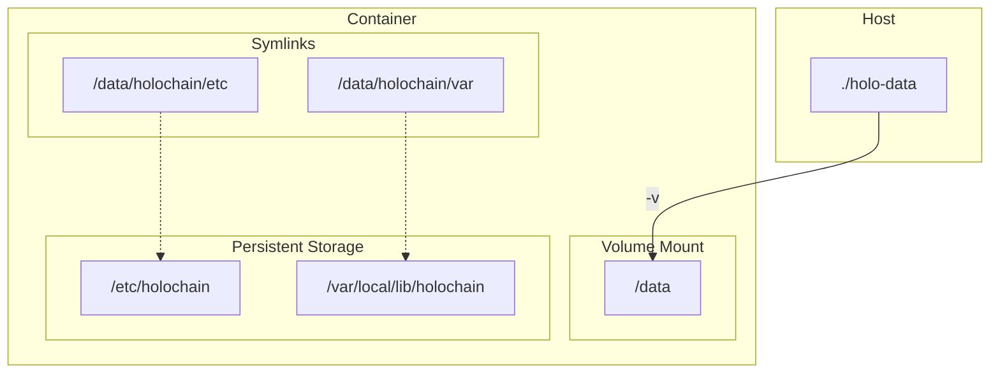

# Trailblazer

The DIY image for technical Holo users.

## Table of Contents

- [Prerequisites](#prerequisites)
- [Getting Started](#getting-started)
   - [Obtaining the Image](#obtaining-the-image)
   - [Running the Container](#running-the-container)

- [Usage](#usage)
   - [Interactive Shell Access](#interactive-shell-access)
   - [Creating a Holochain Sandbox](#creating-a-holochain-sandbox)
   - [Installing a hApp in the Sandbox](#installing-a-happ-in-the-sandbox)
      - [Scripted Install](#scripted-install)
      - [Manual Install (Kando Example)](#manual-install-kando-example)

   - [Running the Sandbox in Debug Mode](#running-the-sandbox-in-debug-mode)

- [Production Deployment with Conductor](#production-deployment-with-conductor)
- [Persistent Storage](#persistent-storage)
   - [Overview](#overview)
   - [Testing Persistence](#testing-persistence)

- [Developer Instructions](#developer-instructions)
   - [Testing Holochain and hc](#testing-holochain-and-hc)

## Prerequisites

- Docker installed and running.
- A GitHub personal access token (classic) with `read:packages` access on the Trailblazer repo if you need to pull private images.

## Getting Started

### Obtaining the Image

Private images are available from [GitHub Packages](https://github.com/Holo-Host/trailblazer/pkgs/container/trailblazer).

```sh
# Log in to GitHub Container Registry
docker login ghcr.io

# Pull the latest image
docker pull ghcr.io/holo-host/trailblazer
```

### Running the Container

To run the container with persistent storage, you need to map a local directory on your host machine to the `/data` volume in the container.

1. **Create a host directory for persistence:**

```sh
mkdir -p ./holo-data
```

2. **Run the container:**

```sh
docker run --name trailblazer -dit \
  -v $(pwd)/holo-data:/data \
  ghcr.io/holo-host/trailblazer
```

This will start the container in detached mode and name it `trailblazer`.

## Usage

### Interactive Shell Access

To access an interactive shell in the running container:

```sh
docker exec -it trailblazer /bin/sh
```

### Creating a Holochain Sandbox

Once you have an interactive shell, you can create a Holochain sandbox.

1. **Switch to the `nonroot` user:**

```sh
su - nonroot
```

2. **Create the sandbox:**
The `entrypoint.sh` script sets up symlinks for persistent storage, so you can use the standard paths. The following command will create a sandbox in `/home/nonroot` and configure it to use persistent storage for the conductor config and data.

```sh
hc sandbox create --root /home/nonroot/ \
  --conductor-config /etc/holochain/conductor-config.yaml \
  --data-root-path /var/local/lib/holochain
```

_Note: The `data_root_path` and `lair_root` in the generated `conductor-config.yaml` will point to `/var/local/lib/holochain`._

3. **Configure WebRTC:**
You need to add WebRTC details to your conductor configuration file to allow for peer-to-peer communication.

```sh
vi /home/nonroot/conductor-config.yaml
```

Find the `webrtc_config` stanza and replace it with the following:

```yaml
  webrtc_config:
    iceServers:
      - urls:
          - stun:stun.cloudflare.com:3478
      - urls:
          - stun:stun.l.google.com:19302
```

4. **Run the sandbox:**

```sh
hc sandbox run 0
```

Note the `admin_port` displayed after the sandbox is run. You will need it to install hApps.

### Installing a hApp in the Sandbox

#### Scripted Install

You can use the `install_happ` script to install a hApp from a JSON configuration file.

1. **Get another interactive shell to the container.**

2. **Run the script:**

```sh
su - nonroot
export ADMIN_PORT=<admin_port>
install_happ <config.json> $ADMIN_PORT
```

#### Manual Install (Kando Example)

1. **Get another interactive shell to the container.**

2. **Switch to the `nonroot` user and set the admin port:**

```sh
su - nonroot
export ADMIN_PORT=<admin_port>
```

3. **Install the hApp:**

```sh
export AGENT_KEY=$(hc s -f $ADMIN_PORT call new-agent | awk '{print $NF}')
export APP_ID="kando::v0.13.0::$AGENT_KEY"
wget https://github.com/holochain-apps/kando/releases/download/v0.13.0/kando.happ
export NETWORK_SEED="<network_seed>"
hc s -f $ADMIN_PORT call install-app ./kando.happ $NETWORK_SEED --agent-key "$AGENT_KEY" --app-id "$APP_ID"
```

4. **Verify the installation:**

```sh
hc s -f $ADMIN_PORT call list-apps
hc s -f $ADMIN_PORT call dump-network-stats
```

### Running the Sandbox in Debug Mode

To get more verbose output from your sandbox, you can run it with the `RUST_LOG` environment variable set to `debug`.

```sh
RUST_LOG=debug hc sandbox run 0
```

### Production Deployment with Conductor

To deploy in production using the Holochain conductor:

1. **Enable Conductor Mode**
   Set the `CONDUCTOR_MODE` environment variable when running the container:
   ```sh
   docker run --name trailblazer -dit \
     -e CONDUCTOR_MODE=true \
     -v $(pwd)/holo-data:/data \
     ghcr.io/holo-host/trailblazer
   ```

2. **Configuration Validation**
   The entrypoint performs automatic validation:
   - Admin port must be `4444`
   - `lair_root` must be empty
   - Configuration must use LSB-compliant paths

3. **Starting the Conductor**
   The conductor will automatically start using the validated configuration:
   ```sh
   holochain -c /etc/holochain/conductor-config.yaml
   ```

4. **Persistent Configuration**
   The conductor configuration is persisted through the same volume mount structure as sandbox mode:
   - `/etc/holochain` → `/data/holochain/etc`
   - `/var/local/lib/holochain` → `/data/holochain/var`

## Persistent Storage

### Overview

The container is configured to store all persistent data in the `/data` directory. This directory is then symlinked to the appropriate locations for Holochain to use.

The following diagram illustrates the volume mapping and symlinks:



- The `holo-data` directory on the host is mounted to `/data` in the container.
- `/data/holochain/etc` is symlinked to `/etc/holochain`.
- `/data/holochain/var` is symlinked to `/var/local/lib/holochain`.

This means that any data written to `/etc/holochain` or `/var/local/lib/holochain` inside the container will be persisted in the `holo-data` directory on your host machine.

### Testing Persistence

A test harness script is provided to verify that persistence is working correctly.

To run the test:

```sh
docker/test_persistence.sh
```

The script will:

1. Create a temporary directory for test data.
2. Start a container and create a test file in a persistent location.
3. Stop and remove the container.
4. Start a new container using the same data directory.
5. Verify that the test file still exists.
6. Clean up all test resources.

## Developer Instructions

### Testing Holochain and hc

To quickly test that the `holochain` and `hc` binaries are functional:

```sh
docker run --name trailblazer -dit ghcr.io/holo-host/trailblazer
docker exec -it trailblazer /bin/sh
which holochain
which hc
holochain --version
 hc --version
lair-keystore --version
```