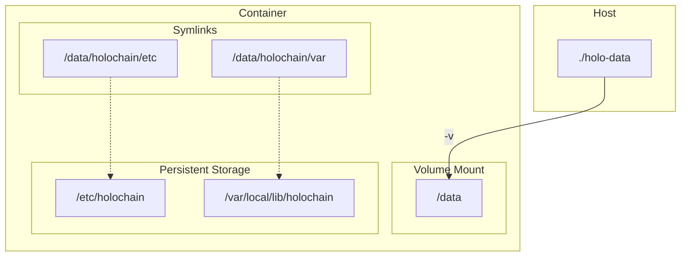

# Edge Node Container

A docker container for running Holochain and installing hApps to host them as always-on-nodes.

Besides `holochain` and `hc`, the following commands are available in the container to manage the hApp lifecycle:

- `list_happs`
- `happ_config_file`
- `install_happ`
- `enable_happ`
- `disable_happ`
- `uninstall_happ`

## Table of Contents

- [Prerequisites](#prerequisites)
- [Getting Started](#getting-started)

   - [Obtaining the Container Image](#obtaining-the-container-image)
   - [Running the Container](#running-the-container)

- [Usage](#usage)

   - [Interactive Shell Access](#interactive-shell-access)
   - [Scripted Install](#scripted-install)
   - [Troubleshooting Logs](#troubleshooting-logs)

- [Production Deployment with Conductor](#production-deployment-with-conductor)
- [Process Management and Logging](#process-management-and-logging)
- [Persistent Storage](#persistent-storage)

   - [Overview](#overview)

## Prerequisites

- Docker installed and running.

## Getting Started

### Obtaining the Container Image

The container images are available from [GitHub Packages](https://github.com/Holo-Host/edgenode/pkgs/container/edgenode).

```sh
# Log in to GitHub Container Registry
docker login ghcr.io

# Pull the latest image
docker pull ghcr.io/holo-host/edgenode
```

### Running the Container

To run the container with persistent storage, you need to map a local directory on your host machine to the `/data` volume in the container.

1. Create the directory for persistent storage:
2. Run the container in the background:

```sh
docker run --name edgenode -dit \
  -v $(pwd)/holo-data:/data \
  ghcr.io/holo-host/edgenode 
```

### Interactive Shell Access

To access an interactive shell in the running container:

```sh
docker exec -it edgenode su - nonroot
```

#### Scripted Install

You can use the `install_happ` script to install a hApp from a JSON configuration file.  URLs for both `.happ` and `.webhapp` files are supported.

1. **Get another interactive shell to the container.**
2. **Run the script:**

```sh
su - nonroot
install_happ <config.json>
enable_happ <APP_ID>
```

#### Listing Installed hApps

To list installed hApps, use the `list_happs` script.

1. **Get another interactive shell to the container.**
2. **Run the script:**

```sh
su - nonroot
export ADMIN_PORT=<admin_port>
list_happs $ADMIN_PORT
```

Or with default port:

```sh
list_happs
```

### Troubleshooting Logs

Holochain logs are redirected to `/data/logs/holochain.log` inside the container for persistence.

- If using a volume mount (e.g., `-v $(pwd)/holo-data:/data`), access logs directly from the host at `./holo-data/logs/holochain.log`.
- To copy logs from a running container: `docker cp edgenode:/data/logs/holochain.log .`
- View live logs: `docker exec -it edgenode tail -f /data/logs/holochain.log`

Logs are rotated daily (see [Process Management and Logging](#process-management-and-logging)) with 7 days retention.

## Production Deployment with Conductor

To deploy in production using the Holochain conductor:

0. Remove any prior containers if you need to: `docker stop edgenode && docker rm edgenode`
1. __Run the Container__
   The Holochain conductor will start up automatically with the container:

```sh
docker run --name edgenode -dit \
  -v $(pwd)/holo-data:/data \
  -p 4444:4444 \
  ghcr.io/holo-host/edgenode
```

2. **Conductor Configuration**

   The Conductor configuration in this container operates on certain conventions:

   - Admin port must be `4444`
   - `lair_root` must be empty
   - Configuration must use LSB-compliant paths

3. **Persistent Configuration**
   The conductor configuration is persisted through the same volume mount structure as sandbox mode:

   - `/etc/holochain` → `/data/holochain/etc`
   - `/var/local/lib/holochain` → `/data/holochain/var`

4. **Install hApp(s)**

`install_happ <config.json>`
5. __Enable hApp(s)__

`enable_happ <APP_ID>`

### Process Management and Logging

The container uses advanced process management and logging for reliability in production.

#### Process Management

- **tini as PID 1**: The init system `tini` is used as the container's PID 1. It handles process supervision, reaps zombie processes, and can restart the Holochain conductor if it crashes (configured via entrypoint.sh).
- **Non-root User**: All processes run as user ID 65532 (nonroot) for security.
- __Supervisor Behavior__:  entrypoint.sh execs `tini -- holochain run ...`, ensuring proper signal handling and restarts. Manual `hc run` commands inside the container are also supervised.

#### Logging

- **Redirection**: Holochain output is redirected to `/data/logs/holochain.log` using `> /data/logs/holochain.log 2>&1` in entrypoint.sh. This captures stdout/stderr for persistence.
- **Persistence**: Logs are stored in the `/data` volume, ensuring they survive container restarts.
- **Directory Setup**: entrypoint.sh creates `/data/logs` if it doesn't exist.

#### Log Rotation

- **Configuration**: Defined in `/etc/logrotate.d/holochain.conf` for daily rotation, keeping 7 days of logs, with compression (gzip).
- **Background Loop**: entrypoint.sh starts a background loop (`while true; do logrotate /etc/logrotate.d/holochain.conf; sleep 86400; done`) to run rotation daily.

This setup ensures robust logging and process reliability without manual intervention.

## Persistent Storage

### Overview

The container is configured to store all persistent data in the `/data` directory. This directory is then symlinked to the appropriate locations for Holochain to use.

The following diagram illustrates the volume mapping and symlinks:



- The `holo-data` directory on the host is mounted to `/data` in the container.
- `/data/holochain/etc` is symlinked to `/etc/holochain`.
- `/data/holochain/var` is symlinked to `/var/local/lib/holochain`.

This means that any data written to `/etc/holochain` or `/var/local/lib/holochain` inside the container will be persisted in the `holo-data` directory on your host machine.

