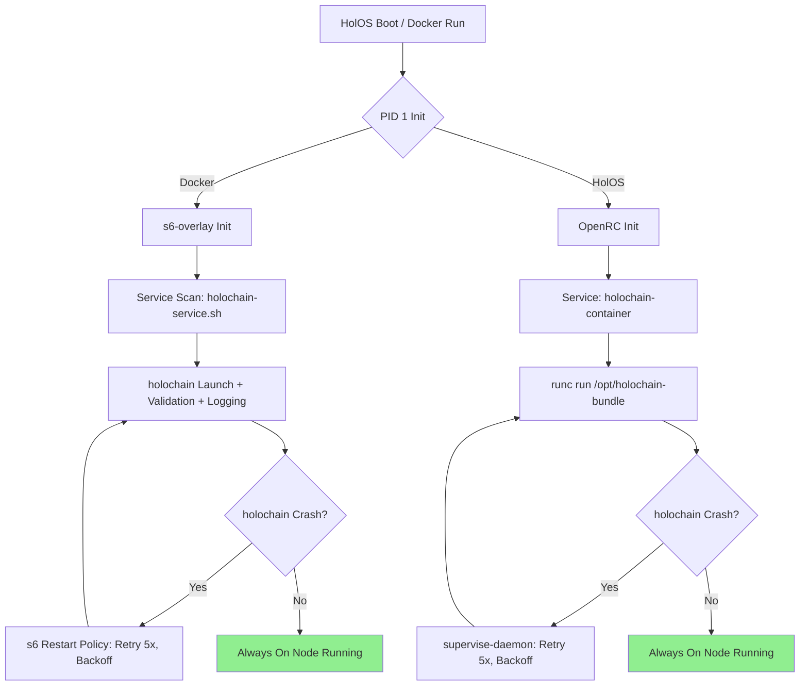

# High Availability Proposal for Holochain "Always On Nodes"

## Executive Summary
This proposal addresses the need for robust process supervision and automatic restarts of the `holochain` process to support "Always On Nodes" for Holochain hApps. The solutions are designed to work out-of-the-box without requiring additional configuration from the hoster deploying the container. We target two scenarios:

1. **Docker Deployments**: The most common runtime, using Docker's ecosystem.
2. **HolOS ISO Deployments**: Custom Buildroot-based OS using runc as the OCI runtime, with OpenRC init.

Current setup analysis reveals that tini (used in Docker entrypoint) does not provide restarts on crash—it exits the container on child failure, relying on external orchestration. For HA, we integrate lightweight internal supervisors to ensure the `holochain` process auto-restarts within the container, providing resilience against crashes while maintaining a clean state.

Key principles:
- **Fail-fast but Recover**: Restart on crash (non-zero exit), but limit retries to avoid infinite loops (e.g., max 5 attempts with exponential backoff).
- **Minimal Overhead**: Use lightweight tools compatible with the project's minimalistic design (Wolfi base for Docker, Buildroot for HolOS).
- **Out-of-the-Box**: Bake supervision into the image/OS build; no runtime flags or host changes needed.
- **Testing**: Include unit/integration tests for crash simulation and restart verification.

## Current Setup Analysis
### Docker (from `docker/Dockerfile` and `docker/entrypoint.sh`)
- **Base Image**: Chainguard Wolfi (minimal, secure Alpine-like distro).
- **Key Components**:
  - Installs `tini`, `holochain` (v0.5.6 binary), `hc`, `lair-keystore`.
  - Copies `happ_tool`, `entrypoint.sh`, config templates, logrotate.
  - ENTRYPOINT: `/usr/local/bin/entrypoint.sh`.
- **Entrypoint Logic**:
  - Sets up persistent dirs (`/data`), symlinks, ownership (nonroot user).
  - Validates conductor config (port 4444, lair_server_in_proc keystore).
  - Runs background logrotate cron.
  - If `CONDUCTOR_MODE=false`: `tini -- tail -f /dev/null` (keeps container alive).
  - If `CONDUCTOR_MODE=true` (default implied): `tini -- gosu nonroot yes '' | holochain --piped --config-path /etc/holochain/conductor-config.yaml | tee /data/logs/holochain.log 2>&1`.
- **HA Gaps**:
  - Tini acts as PID 1 for zombie reaping/signals but does not restart `holochain` on crash/exit.
  - The pipe (`yes | holochain | tee`) keeps stdin open but fails the container on `holochain` crash.
  - No internal supervision; relies on external Docker restart policies (e.g., `--restart=on-failure`), which require hoster config—not out-of-the-box.
  - Logs are captured, but restarts would lose state unless persisted (already using `/data` VOLUME).

### HolOS (from `holos/` files)
- **Build System**: Buildroot 2025.08 with custom config (`holos-buildroot-2025.08.config`); uses OpenRC skeleton for init.
- **Kernel/Boot**: Custom kernel (`kernel-config-x86_64.config`), hybrid ISO with isolinux.cfg; boots to minimal userspace.
- **Init System**: OpenRC; overlay includes `/etc/init.d/S05platform` script.
  - S05platform: Loads platform drivers (PCI/USB via modprobe from sysfs uevents); supports start/stop/restart but no container-specific logic.
- **Container Management**: User-confirmed runc (OCI runtime); no explicit supervision in current overlay. HolOS is designed for Holochain containers, but init scripts focus on hardware/platform setup, not app-level HA.
- **HA Gaps**:
  - No built-in service for running/supervising runc containers.
  - OpenRC can manage services, but `holochain` container launch/restart needs a custom service script.
  - Runs in RAM (no persistent storage yet); supervision must handle ephemeral restarts.
  - No current integration with runc exec or bundle management for auto-restart.

## Proposed Solutions
### 1. Docker HA Solution: Integrate s6-overlay for Internal Supervision
**Rationale**: s6-overlay is lightweight (~1-2MB), designed for containers, and provides PID 1 init with automatic restarts. It replaces tini for supervision while retaining signal handling/zombie reaping. Out-of-the-box: Bake into Dockerfile; `holochain` auto-restarts on crash without Docker flags.

**High-Level Design**:
- Layer s6-overlay on Wolfi base.
- Define s6 service for `holochain` with `restart-policy = yes` (auto-restart on exit !=0, max retries=5, backoff).
- Modify entrypoint to use s6's `/init` as PID 1, launching `holochain` as supervised service.
- Preserve current logic (dirs, validation, logging) in a wrapper script.

**Pros**:
- Zero host config; works with plain `docker run`.
- Handles multi-process (e.g., logrotate + holochain).
- Integrates with existing piping/logging.

**Cons**:
- Adds minor build complexity (multi-stage Dockerfile for s6).
- Overkill if external orchestration is always used, but ensures standalone HA.

### 2. HolOS/runc HA Solution: Add OpenRC Service for Supervised Runc Container
**Rationale**: OpenRC supports `supervise-daemon` for auto-restarts (compatible with Buildroot). Create a custom OpenRC service (`/etc/init.d/holochain-container`) that launches the runc container bundle and supervises it. Enable at boot via OpenRC defaults. Out-of-the-box: Include in Buildroot overlay; auto-starts on HolOS boot.

**High-Level Design**:
- Assume runc bundle in `/opt/holochain-bundle` (pre-built with config, binaries from Docker image).
- Service script: Uses `runc run` to start container; `supervise-daemon` wraps for restarts (extra_commands for stop/kill).
- Extend S05platform or add S99holochain for boot ordering.
- Persist state via tmpfs mounts or future disk support.

**Pros**:
- Leverages OpenRC's dependency management (e.g., after networking).
- Minimal footprint; no full supervisor like systemd.
- Ensures HA from OS boot, ideal for dedicated HolOS hardware.

**Cons**:
- Requires defining runc bundle in HolOS build (e.g., copy Docker image layers).
- Less flexible than Docker for multi-container; assumes single holochain instance.

## Implementation Details
### Docker Changes
1. **Update Dockerfile** (multi-stage for s6-overlay):
   ```
   # Stage 1: Build s6-overlay (use official or build from source)
   FROM alpine:3.19 AS s6-builder
   RUN apk add --no-cache build-base linux-headers s6-overlay
   # ... (build s6 if needed; or COPY pre-built)

   # Stage 2: Main image
   FROM cgr.dev/chainguard/wolfi-base
   COPY --from=s6-builder /usr/bin/s6* /usr/bin/
   # Install existing packages + s6 tools
   RUN apk update && apk add --no-cache ... tini logrotate shadow gosu s6 s6-linux-utils
   # Existing RUN wget for binaries...
   # Copy files as before
   # New: Copy s6 service dir
   RUN mkdir -p /etc/s6-overlay/s6-rc.d/holochain
   COPY holochain-service.sh /etc/s6-overlay/s6-rc.d/holochain/run  # Wrapper script
   RUN chmod +x /etc/s6-overlay/s6-rc.d/holochain/run
   # Update entrypoint to s6 init
   ENTRYPOINT ["/init"]  # s6's PID 1
   ```
2. **New `holochain-service.sh` (in repo)**: Wrapper for current entrypoint logic + holochain launch.
   ```
   #!/bin/sh
   set -eu
   # Setup dirs, validation, logrotate as in current entrypoint.sh
   # Launch holochain
   exec gosu nonroot holochain --piped --config-path /etc/holochain/conductor-config.yaml
   ```
3. **s6 Config** (`/etc/s6-overlay/s6-rc.d/holochain/dependencies.d/start`): Depend on logrotate service.
   - Set `s6-svscan` to scan services; enable auto-restart in `/etc/s6-overlay/s6-rc.conf`.
4. **Testing**:
   - Build image: `docker build -t holochain-ha .`
   - Run: `docker run -e CONDUCTOR_MODE=true -v /path/to/data:/data holochain-ha`
   - Simulate crash: `docker exec <id> kill -9 $(pgrep holochain)`
   - Verify: Logs show restart; process respawns within 5s, up to 5 retries.
   - Integration: Use existing `test_default_conductor.sh` + crash simulation.

### HolOS Changes
1. **Update Buildroot Config** (`holos-buildroot-2025.08.config`): Enable OpenRC supervise-daemon, runc package.
   ```
   BR2_PACKAGE_OPENVPN=y  # If needed for networking
   BR2_PACKAGE_RUNC=y
   BR2_PACKAGE_OPENRC_SUPERVISE_DAEMON=y
   ```
2. **New OpenRC Service** (`holos/overlay/etc/init.d/holochain-container`):
   ```
   #!/sbin/openrc-run
   name="holochain-container"
   description="Supervised Holochain runc container"
   command="/usr/bin/runc run -b /opt/holochain-bundle holochain-instance"
   command_background=true
   pidfile="/run/${name}.pid"
   supervisord_start() {
       start-stop-daemon --start --exec $command --background --pidfile $pidfile
   }
   # Use supervise-daemon for restarts
   supervise_daemon_args="--start --retry 5 --backoff 10"
   depend() { need net; }
   ```
   - Make executable, add to `/etc/init.d/` in overlay.
3. **Runc Bundle Setup**: In HolOS Makefile/overlay, extract Docker image to `/opt/holochain-bundle` (use `docker save | tar` in build).
   - Config: Mount `/data` to persistent dir (future: add fstab for disk).
4. **Boot Integration**: Add to OpenRC defaults (`/etc/conf.d/holochain-container`): `holochain-container_enable="YES"`.
   - Extend S05platform if needed for bundle prep.
5. **Testing**:
   - Build ISO: `make iso`
   - Boot in QEMU: `make run`; verify service starts (`rc-service holochain-container start`).
   - Crash sim: Kill inside container; check OpenRC logs (`/var/log/rc.log`), verify restart.
   - Persistence: Test with simulated disk mount.

## Mermaid Diagram: HA Architecture


## Pros/Cons and Rationale
- **Overall Pros**: Ensures HA without hoster intervention; aligns with "Always On" by restarting on transient crashes (e.g., network blips). Minimal changes to existing code.
- **Overall Cons**: Internal supervision adds ~5-10MB; potential for restart loops on persistent bugs (mitigated by retry limits). Requires build updates.
- **Rationale**: s6 for Docker (container-native, replaces tini seamlessly). OpenRC/supervise-daemon for HolOS (native to Buildroot, no external deps). Both support logging/persistence via `/data`. Prioritizes simplicity over full orchestrators (e.g., no Kubernetes assumption).

This proposal can be implemented in ~2-3 days, starting with Docker (easier testing). Total impact: Enhanced reliability for hApps.